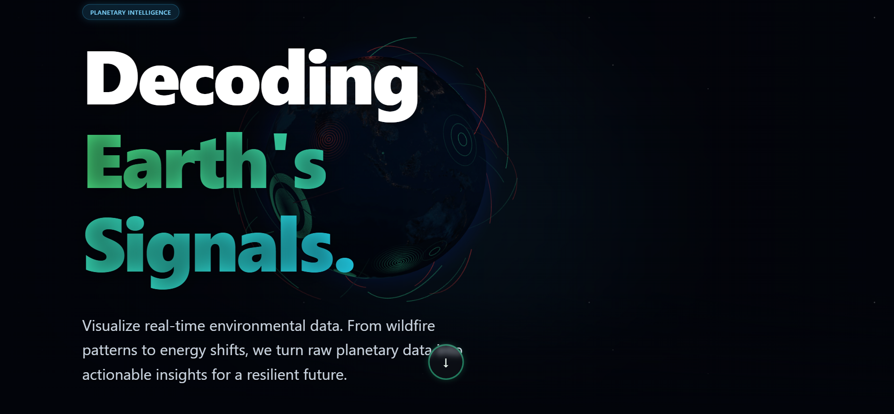
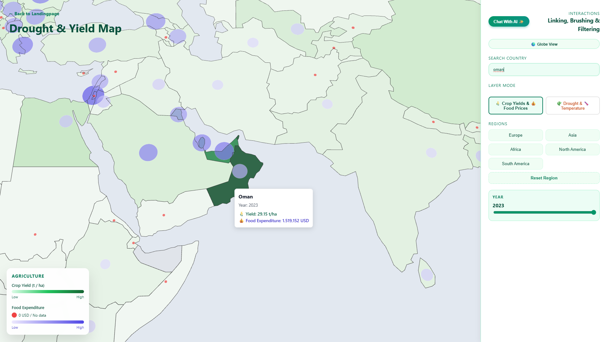
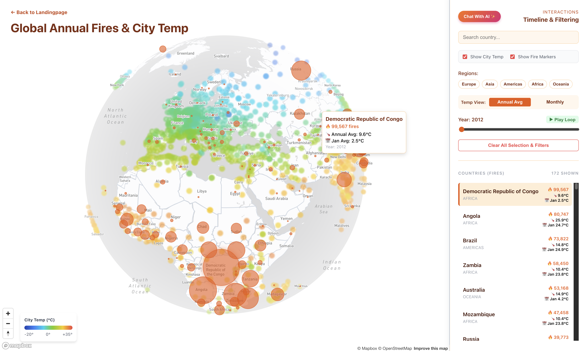
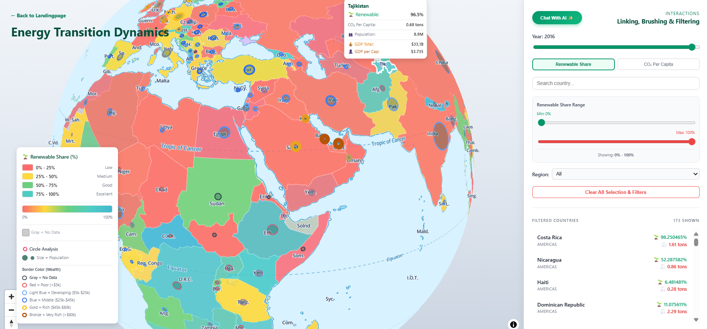
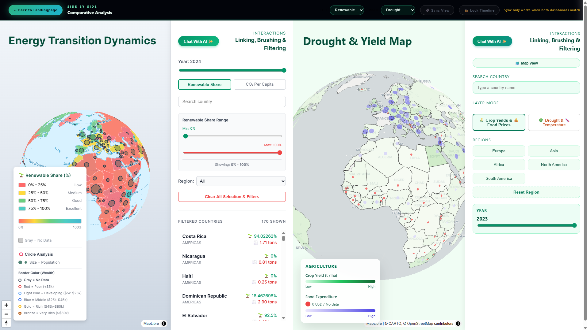

# Decoding Earth's Signals

**Interactive Visualization of Long-Term Climate Trends and Extreme Events**

A Climate Exploration Platform designed to track long-term climate trends and highlight extreme weather events globally. Optimized for high-resolution large displays (such as the Powerwall), the platform enables exploratory, side-by-side comparative analysis of heterogeneous data including renewable energy adoption, drought indices, and wildfire risks.

> Built for the *Visual Data Analysis* course at the University of Konstanz, Germany.

---

## Dashboards

### Landing Page
The immersive entry point featuring a continuous 3D spinning globe animation with scroll-triggered storytelling to introduce the three primary analytical themes.



### Drought Index Dashboard
An interactive map-based environment for exploring relationships between agricultural indicators (crop yields, food expenditure) and climatic conditions (drought events, temperature patterns). Supports layer toggling between agricultural and climate data, 2D/3D globe transitions, region filtering, and temporal navigation.



### Wildfire Index Dashboard
Visualizes the spatio-temporal relationship between global temperature patterns and wildfire activity on a 3D globe. Features a dual-layer overlay (temperature heatmap + fire occurrences), temporal resolution switching (annual/monthly), play loop with auto-rotation, and linked map-sidebar interactions.



### Renewable Energy Dashboard
Analyzes the relationship between renewable energy adoption, carbon emissions, population, and economic wealth. Multi-dimensional encodings map renewable share and CO2 per capita to choropleth colors, population to circle size, and GDP per capita to border colors.



### Side-by-Side Comparative View
Leverages Powerwall dimensions to load two independent dashboard themes in parallel. Provides synchronized map panning/zooming ("Sync View") and timeline locking ("Lock Timeline") via the HTML5 `postMessage` API.



### AI Assistant
A GPT-powered contextual assistant integrated across all dashboards. Uses dynamic prompt engineering to inject the active dashboard state (year, filters, visible data) into the system prompt, enabling data-grounded explanations.

---

## Tech Stack

| Layer | Technology |
|-------|-----------|
| Frontend | React, TypeScript, Vite |
| Geospatial | Deck.gl (WebGL), Mapbox GL, MapLibre GL |
| 3D Globe | react-globe.gl, Three.js |
| Charts & Scales | D3.js |
| Backend | Python, FastAPI |
| Data Processing | pandas, scikit-learn (MiniBatchKMeans) |
| AI Integration | OpenAI API (GPT) |
| Deployment | Docker, Docker Compose |

---

## Project Structure

```
group-1-main/
├── README.md
├── presentations/                        # Powerwall presentation slides
│
└── group-1-template/
    ├── docker-compose.yml
    │
    ├── frontend/
    │   └── vite-app/
    │       ├── src/
    │       │   ├── App.tsx               # Root component & routing
    │       │   ├── pages/
    │       │   │   ├── LandingPage.tsx    # Entry page with 3D globe
    │       │   │   ├── Drought.tsx        # Drought Index Dashboard
    │       │   │   ├── Wildfires.tsx      # Wildfire Index Dashboard
    │       │   │   ├── RenewableSharePage.tsx  # Renewable Energy Dashboard
    │       │   │   └── CompareDashboard.tsx     # Side-by-Side view
    │       │   ├── ui/components/         # Globe hero, animated globe
    │       │   ├── hooks/                 # Custom React hooks
    │       │   ├── utils/                 # Utility functions
    │       │   └── api-handler/           # Backend API requests
    │       └── public/data/              # CSV datasets & clustering scripts
    │
    └── backend/
        ├── app/
        │   ├── main.py                   # FastAPI entry point
        │   ├── api/routers/
        │   │   ├── data_routes.py        # Data API endpoints
        │   │   └── openai_router.py      # AI chat proxy
        │   ├── config/                   # Settings & paths
        │   └── lifecycle/                # Data loading manager
        └── sample_data/                  # Preprocessed CSV & GeoJSON files
```

---

## Data Sources

- **City Temperature Data** — Meteostat (daily, city-level, 1951–2025)
- **Renewable Energy & CO2** — Our World in Data
- **Wildfire Occurrences** — Our World in Data (OWID)
- **Drought Events** — European Commission JRC (SPEI-3 index)
- **Agricultural Data** — Cereal yields & food expenditure (OWID)

### Data Preprocessing

Raw temperature data covering thousands of cities globally was clustered into **2,000 spatial groups** using **MiniBatchKMeans** to achieve ~95% data reduction while preserving macro-level temperature patterns. This enables smooth 60 FPS WebGL animations on large displays.

---

## Installation & Setup

### Prerequisites
- Docker & Docker Compose
- Git
- `.env` files (see below)

### 1. Environment Files (Important!)

> **The application will NOT start without the `.env` files.** Both the frontend and backend require their own `.env` file containing API keys (Mapbox, OpenAI, backend URL, etc.). These files are not included in the repository for security reasons.
>
> **Please contact the team via email to receive the `.env` files before attempting to run the project:**
> - emrecan.ulu@uni-konstanz.de
> - suereyya.dagdeviren@uni-konstanz.de
> - sophie.unterfranz@uni-konstanz.de

Once received, place the files in the following locations:

```
group-1-template/
├── frontend/
│   └── vite-app/
│       └── .env          # VITE_MAPBOX_TOKEN, VITE_BACKEND_API_URL
└── backend/
    └── .env              # OPENAI_API_KEY
```

### 2. Clone & Run

```bash
git clone <repository-url>
cd group-1-main/group-1-template
```

**Start the application:**
```bash
docker compose up --build
```

**Stop and clean up (removes containers & volumes):**
```bash
docker compose down -v
```

**Rebuild after changes:**
```bash
docker compose down -v
docker compose up --build
```

### 3. Access

Once the containers are running, open **http://localhost:3000** in your browser.

---

## Team & Contributions

| Member | Contributions |
|--------|--------------|
| **Emrecan Ulu** | Core architecture lead, Git maintenance, data pipeline (Meteostat fetch + MiniBatchKMeans clustering), foundational UI design (control bars, filters, layout), Wildfire Index Dashboard, GPT AI integration (prompt engineering), co-developed Landing Page |
| **Sophie Unterfranz** | Drought Index Dashboard (layer toggling, 2D/3D transitions), Side-by-Side Analysis (postMessage synchronization for Powerwall), co-developed Landing Page |
| **Süreyya Dagdeviren** | Data merging/cleaning/preprocessing pipeline, Renewable Energy Dashboard (multi-dimensional encodings, choropleth rendering), co-developed Landing Page |
